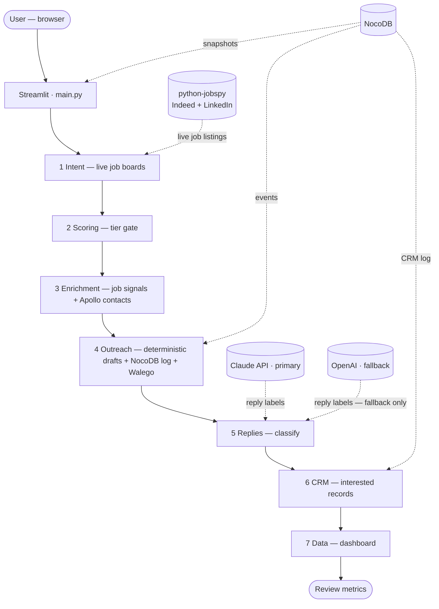

# 🚀 IntentFlow: High-Intent Growth Engine

**The Philosophy**: Stop spraying and praying. Target prospects based on real-time "intent" (signals that they actually need your help right now) instead of just sending thousands of cold emails.

---

## 🌟 How It Works (For Beginners)

This app automates a 4-step professional sales process:

1.  **Discovery**: We listen to social signals (LinkedIn/X) to find people discussing pain points.
2.  **Enrichment**: We automatically find their verified business emails using a "waterfall" of top-tier data providers.
3.  **Outreach**: We draft highly personalized emails that mention their specific problem and company.
4.  **Campaign Stats**: We summarize the results and prepare the data for your CRM (Salesforce/HubSpot).

---

## 🛠️ How to Start (Step-by-Step)

### 1. Prerequisite
Ensure you have **Python** installed on your computer. If not, download it from [python.org](https://www.python.org/).

### 2. Setup the Project
Open your terminal (or Command Prompt) and navigate to this folder. Run this command to install the "engine" that powers the app:
```bash
pip install -r requirements.txt
```

Create your environment file and fill real provider credentials:
```bash
cp .env.example .env
```

### 3. Launch the App
Run this command to open the IntentFlow dashboard in your web browser:
```bash
streamlit run main.py
```

Required / supported providers in this build:
- **Anthropic Claude (direct API)** — primary LLM. Used for reply classification and (optional) email / role drafting.
- **OpenAI (direct API)** — fallback LLM. Same role as Claude, used only when Claude is unreachable.
- **python-jobspy** — live verified job listings from Indeed / LinkedIn (the only source of truth for intent).
- **NocoDB** — session snapshots, dispatch + CRM event log.
- **Apollo.io** (optional) — set `APOLLO_API_KEY` (master key) to enrich companies with verified sales contacts (search + `people/match`; consumes credits). Tune batch size with `ENRICHMENT_MAX_COMPANIES`.

OpenRouter has been **removed** from the build. Both Anthropic and OpenAI are
called via their official direct APIs using your paid keys.

---

## Production-safety policy (May 2026)

This build is locked down for client safety:

1. **Zero AI-generated contacts.** Name / Email / Phone / LinkedIn are filled from
   **Apollo.io** when `APOLLO_API_KEY` is set (real API data, not the LLM), or left
   blank until that key (or a future CSV path) is available. Rows without an Apollo
   hit stay on job signals only.
2. **Only verified data sources are surfaced.** Job listings come from
   `python-jobspy` (live Indeed/LinkedIn scrape). The previous synthetic
   LLM-generated job-corpus fallback is gated behind
   `ALLOW_SYNTHETIC_INTENT_CORPUS=1` and is **off** by default.
3. **Dispatch is gated.** Outreach will only send for leads with
   `Enrichment verified = true` **and** a non-empty `Email`. Everything else
   is held with status `Awaiting verified contact` for SDR review.
4. **Deterministic by default.** Email sequences and role suggestions render
   from templates (no per-lead LLM call) so the pipeline is fast and never
   hallucinates a recipient name. The LLM can be re-enabled for these via
   `EMAIL_LLM_AUGMENT=1` / `ROLE_SUGGESTIONS_LLM=1` once a verified contact
   pipeline is in place.

---

## 🧪 Testing the "Real Email" Feature

To see how the personalized emails look in an actual inbox:

1.  **Set Your Email**: In the left sidebar of the app, enter your own email address under "Test Email Destination."
2.  **Activate Identity**: In the **Outreach** screen, click **"Activate Identity"**. This will open a new tab from **FormSubmit.co**. 
    *   *Check your inbox for a confirmation email and click the link to verify.*
3.  **Send a Test**: Go back to the app and click **"Dispatch 🚀"** on any lead. 
    *   *You will receive the personalized outreach email directly in your inbox as if it was sent to the prospect!*

---

## 📁 What’s Inside? (The Architecture)
- `main.py`: The visual dashboard you see in your browser.
- `internal_intent.py` / `pipeline.py`: Live job-board corpus + company scoring.
- `enrichment.py` + `apollo_enrichment.py`: Job signals + optional Apollo person/email enrichment.
- `outreach.py`: The "writer" that drafts personalized messages and handles sending.
- `requirements.txt`: The list of background tools the app needs to run.

## Architectural flow

**End-to-end (what runs in order)**



**Pipeline only (left → right)**


Plain-text version (always readable):

```
User → Streamlit (main.py)

Intent → Scoring → Enrich → Outreach → Replies → CRM → Dashboard

python-jobspy:  live Indeed/LinkedIn listings (the only intent source by default)
Claude (direct): reply classification + optional email/role augmentation
OpenAI (direct): fallback for the same tasks if Claude is unreachable
NocoDB:          session snapshots · dispatch + events · CRM event log
Apollo (`APOLLO_API_KEY`): optional; fills verified contacts before dispatch. Without it, person fields stay empty.
```
