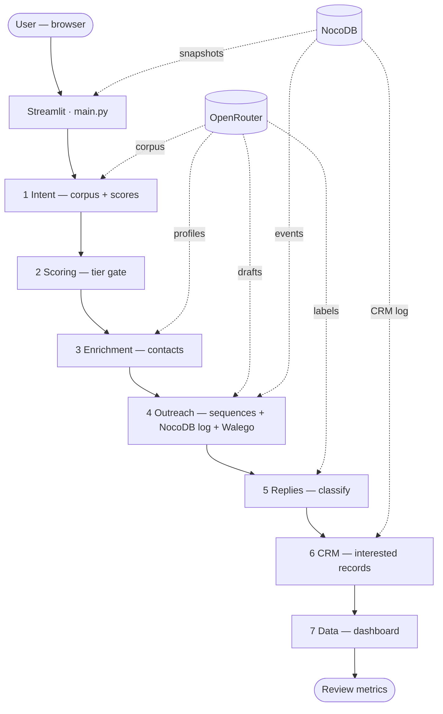
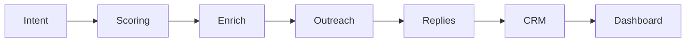

# 🚀 IntentFlow: High-Intent Growth Engine

**The Philosophy**: Stop spraying and praying. Target prospects based on real-time "intent" (signals that they actually need your help right now) instead of just sending thousands of cold emails.

---

## 🌟 How It Works (For Beginners)

This app automates a 4-step professional sales process:

1.  **Discovery**: We listen to social signals (LinkedIn/X) to find people discussing pain points.
2.  **Enrichment**: We automatically find their verified business emails using a "waterfall" of top-tier data providers.
3.  **Outreach**: We draft highly personalized emails that mention their specific problem and company.
4.  **Campaign Stats**: We summarize the results and prepare the data for your CRM (Salesforce/HubSpot).

---

## 🛠️ How to Start (Step-by-Step)

### 1. Prerequisite
Ensure you have **Python** installed on your computer. If not, download it from [python.org](https://www.python.org/).

### 2. Setup the Project
Open your terminal (or Command Prompt) and navigate to this folder. Run this command to install the "engine" that powers the app:
```bash
pip install -r requirements.txt
```

Create your environment file and fill real provider credentials:
```bash
cp .env.example .env
```

### 3. Launch the App
Run this command to open the IntentFlow dashboard in your web browser:
```bash
streamlit run main.py
```

Required providers in this build:
- OpenRouter (email generation + reply classification)
- Apify (jobs + social datasets)
- Apollo + Hunter (contact enrichment waterfall)
- AWS SES (email send)
- HubSpot (CRM sync)
- IMAP inbox (reply ingestion)

---

## 🧪 Testing the "Real Email" Feature

To see how the personalized emails look in an actual inbox:

1.  **Set Your Email**: In the left sidebar of the app, enter your own email address under "Test Email Destination."
2.  **Activate Identity**: In the **Outreach** screen, click **"Activate Identity"**. This will open a new tab from **FormSubmit.co**. 
    *   *Check your inbox for a confirmation email and click the link to verify.*
3.  **Send a Test**: Go back to the app and click **"Dispatch 🚀"** on any lead. 
    *   *You will receive the personalized outreach email directly in your inbox as if it was sent to the prospect!*

---

## 📁 What’s Inside? (The Architecture)
- `main.py`: The visual dashboard you see in your browser.
- `leads.py`: The "brain" that filters for high-intent prospects.
- `enrichment.py`: The "detective" logic that finds missing contact info.
- `outreach.py`: The "writer" that drafts personalized messages and handles sending.
- `requirements.txt`: The list of background tools the app needs to run.

## Architectural flow

**End-to-end (what runs in order)**



**Pipeline only (left → right)**



Plain-text version (always readable):

```
User → Streamlit (main.py)

Intent → Scoring → Enrich → Outreach → Replies → CRM → Dashboard

OpenRouter: intent corpus · contact profiles · email drafts · reply labels
NocoDB:     session snapshots · dispatch + events · CRM event log
```
